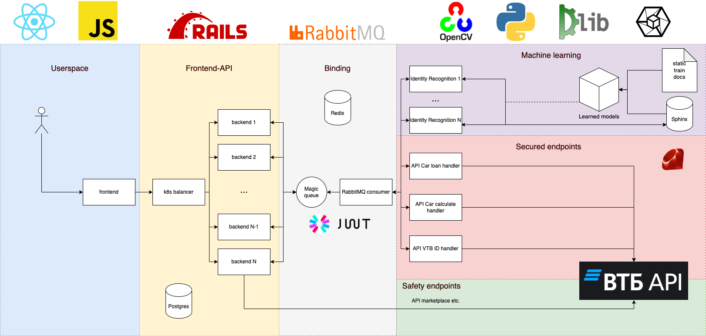

# API Dealer

## Установка с помощью docker-compose 

```sh
git clone --recursive git@gitlab.bankingapi.ru:vtb-api/api-dealer.git
cd api-dealer
docker-compose build
docker-compose up
```
Затем перейти по `localhost` и проверить работу 

## Деплой в кластер с помощью helm
```sh
helm install <release-name> api-dealer
```

## Архитектура


